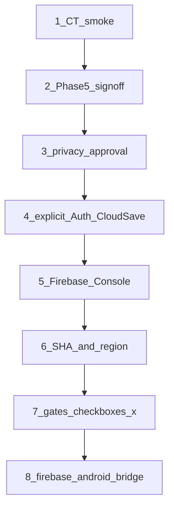

# Stage 4 — OWNER gate sequence (walkable)

| Поле             | Значення                                                                                        |
| ---------------- | ----------------------------------------------------------------------------------------------- |
| Призначення      | Один шлях від **CT smoke** до flip gates → лише потім runtime bridge                            |
| Статус CT зараз  | **`pending`** — не стверджувати completed без Play opt-in smoke                                 |
| Цей документ     | На `main` після merge **#72** (`de01730…`) — інструкції готові; **CT ще не виконано**           |
| Runtime / bridge | **BLOCKED** — не стартувати `godot/firebase-android-bridge`, SDK, `INTERNET=true`               |
| Flip gates       | Лише OWNER у [`FIREBASE_STAGE4_GATES.md`](FIREBASE_STAGE4_GATES.md) після фактів нижче          |
| Агент з репо     | Готує цей handoff; **не** ставить `[x]` у gates і **не** оголошує CT / Phase 5 / Console «done» |



> **Негайний OWNER крок:** крок **1 (CT smoke)**. Усе нижче блокується, доки він не зелений.

---

## Швидкий paste-чеклист (укр.)

Скопіюй і відмічай локально (не в PR агента):

```text
Stage 4 OWNER — порядок:
[ ] 1. CT smoke: див. CT_SMOKE_CHECKLIST.md (upload→opt-in→Boot→Menu→merge→save→force-stop→restore→Back→GO/NO-GO)
[ ] 2. Phase 5: довга сесія на пристрої — немає UI/grid/FPS регресій; записати дату/пристрій
[ ] 3. Privacy: прочитати FIREBASE_PRIVACY_DELTA; погодити INTERNET+Auth+Firestore + Data safety хвилю
[ ] 4. Explicit go: Google-only Auth + opt-in Cloud Save (не Anonymous/Email; не 4C leaderboards)
[ ] 5. Firebase Console: lost-number-dev + lost-number-prod; обидва package; Auth Google only; budget alerts
[ ] 6. SHA (debug/upload/Play App Signing) + region confirm (рекомендація europe-west3)
[ ] 7. Усі [x] у docs/FIREBASE_STAGE4_GATES.md + дата go
[ ] 8. ТІЛЬКИ ПІСЛЯ 7: дозволити агенту PR godot/firebase-android-bridge
```

---

## 1. Closed testing smoke (OWNER) — **зараз**

**Канонічний чеклист:** [`CT_SMOKE_CHECKLIST.md`](CT_SMOKE_CHECKLIST.md) (upload → opt-in → Boot → Menu → merge → save → force-stop/relaunch → restore → Back → GO/NO-GO).

**Документи:** [`CLOSED_TESTING_RUNBOOK.md`](CLOSED_TESTING_RUNBOOK.md), AAB/SHA у [`STAGE1_RELEASE_RECORD.md`](STAGE1_RELEASE_RECORD.md) + [`STAGE3_CLOSEOUT.md`](STAGE3_CLOSEOUT.md), recon [`PLAY_CONSOLE_RECON.md`](PLAY_CONSOLE_RECON.md).

| Поле (кандидат)    | Значення (не змінювати з агента без перезбірки)                    |
| ------------------ | ------------------------------------------------------------------ |
| AAB source commit  | `2ef0fcdf2aaf5083cf79c88a41b989720e137b47`                         |
| AAB SHA-256        | `398b83f33d79b878e71ca1262d6cfac2e0a981045d77299a5c0824c1dba848c4` |
| versionName / Code | `2.1.6` / `16`                                                     |
| Package            | `com.Averixor.Lost_Number`                                         |
| Локальний файл     | `build/android/lost-number.aab` (SHA збігається з record)          |

**Дії:** виконати всі 10 кроків у [`CT_SMOKE_CHECKLIST.md`](CT_SMOKE_CHECKLIST.md). CT `pending` → `completed` **лише при GO**.

**Не робити:** оголошувати CT completed з репо / без Play install / без force-stop restore.

---

## 2. Phase 5 device perf sign-off (OWNER)

**Документи:** [`PHASES.md`](PHASES.md) § Фаза 5, perf/сценарії [`ANDROID_QA.md`](ANDROID_QA.md), критерій у gates.

**Дії:**

1. Довга сесія на CT-збірці або debug APK (`com.Averixor.Lost_Number.dev`): сітка синхронна, немає помітного jank / UI регресій.
2. Записати **дату + пристрій + build** (CT AAB або debug) у нотатку біля Phase 5 пункту в [`FIREBASE_STAGE4_GATES.md`](FIREBASE_STAGE4_GATES.md) або short note в `PHASES.md`.
3. Немає відкритих P0/P1 з CT feedback перед flip.

---

## 3. Privacy approval (OWNER)

**Документ:** [`FIREBASE_PRIVACY_DELTA.md`](FIREBASE_PRIVACY_DELTA.md).

**Дії:**

1. Прочитати delta: після bridge з’являться `INTERNET` + Google Auth + Firestore; privacy / Play Data safety / SoT оновлюються **в одній хвилі** з Firebase-capable build.
2. Підтвердити: Crashlytics / Analytics / Remote Config **не** вмикати «заодно».
3. Поставити `[x]` privacy review у gates **після** власного approve (не агентом).

---

## 4. Explicit Google Auth + Cloud Save approve (OWNER)

Окремий явний go (не «може пізніше»):

| Approve                                      | Rejected for now (Stage 4 MVP)       |
| -------------------------------------------- | ------------------------------------ |
| Google-only Auth                             | Anonymous / Email / Phone / Facebook |
| Opt-in Cloud Save поверх SaveManager         | Leaderboards **4C**                  |
| Offline-first без акаунта залишається нормою | WebView / JS / Capacitor SDK         |

Зафіксувати approve датою в gates (пункт Product / privacy).

---

## 5. Firebase Console setup (OWNER)

**Документ:** [`FIREBASE_OWNER_RUNBOOK.md`](FIREBASE_OWNER_RUNBOOK.md).

1. Створити проєкти `lost-number-dev` і `lost-number-prod`.
2. Android apps: `com.Averixor.Lost_Number` + `com.Averixor.Lost_Number.dev`.
3. Auth: **лише Google**.
4. Firestore **після** підтвердження region (крок 6).
5. Budget alerts; обмежений Console access.
6. `google-services.json` лише локально / CI secrets — **не** в git ([`android/firebase/`](../android/firebase/)).

**Не робити з агента:** створювати Firebase проєкти / фейкати Console setup.

---

## 6. SHA + region confirmation (OWNER)

**Документи:** [`FIREBASE_OWNER_RUNBOOK.md`](FIREBASE_OWNER_RUNBOOK.md) § SHA, fingerprints [`PLAY_CONSOLE_RECON.md`](PLAY_CONSOLE_RECON.md), AAB file hash у STAGE1 (не плутати з signing cert).

| Тип SHA          | Навіщо                            |
| ---------------- | --------------------------------- |
| Debug            | Sign-In на debug APK              |
| Upload           | Локально підписані release / AAB  |
| Play App Signing | Збірки, перепідписані Google Play |

Region: kickoff рекомендує **`europe-west3`** (Frankfurt) — OWNER **підтверджує** перед prod DB.

Записати підтвердження в gates / runbook notes.

---

## 7. Flip gates `[x]` (OWNER) — **останній docs-крок перед кодом**

Файл: [`FIREBASE_STAGE4_GATES.md`](FIREBASE_STAGE4_GATES.md).

1. Усі обовʼязкові чекбокси → `[x]` (окремий docs PR або прямий commit OWNER).
2. Додати дату go + посилання на CT smoke / Phase 5 note.
3. Статус runtime у gates: зняти BLOCKED лише після повного flip.

**Лише після цього** runtime вважається розблокованим.

---

## 8. Runtime bridge (код) — **після** кроку 7

Гілка / PR: `godot/firebase-android-bridge` (за [`en/FIREBASE_ADR.md`](en/FIREBASE_ADR.md)).

- Kotlin plugin + GDScript bridge; **без** Cloud Save UI / Settings panel.
- `INTERNET` + `ACCESS_NETWORK_STATE` у цьому або негайно наступному privacy-coupled PR.
- Немає Analytics / Crashlytics / 4C leaderboards у першому bridge PR.
- Gates агента: `release:check`, `godot:test:all`, debug APK smoke (plugin loads).

Далі: AuthManager → codec → rules → sync → conflict UI → privacy console → CT Firebase (див. [`ROADMAP.md`](ROADMAP.md) § Етап 4).

---

## Що свідомо не робити зараз

| Заборона                                      | Чому                             |
| --------------------------------------------- | -------------------------------- |
| Bridge / Firebase SDK / `INTERNET=true`       | Gates ще ☐; CT `pending`         |
| Агент ставить `[x]` у `FIREBASE_STAGE4_GATES` | Лише OWNER після факту           |
| CT = completed без Play opt-in smoke          | Немає credentials / smoke з репо |
| Змішувати bridge з 4C / visual polish         | Scope control                    |

---

## Індекс повʼязаних документів

| Крок / тема         | Документ                                                   |
| ------------------- | ---------------------------------------------------------- |
| CT smoke            | [`CLOSED_TESTING_RUNBOOK.md`](CLOSED_TESTING_RUNBOOK.md)   |
| AAB SHA / source    | [`STAGE1_RELEASE_RECORD.md`](STAGE1_RELEASE_RECORD.md)     |
| Stage 3 / CT status | [`STAGE3_CLOSEOUT.md`](STAGE3_CLOSEOUT.md)                 |
| Phase 5             | [`PHASES.md`](PHASES.md), [`ANDROID_QA.md`](ANDROID_QA.md) |
| Privacy             | [`FIREBASE_PRIVACY_DELTA.md`](FIREBASE_PRIVACY_DELTA.md)   |
| Console / SHA       | [`FIREBASE_OWNER_RUNBOOK.md`](FIREBASE_OWNER_RUNBOOK.md)   |
| Flip last           | [`FIREBASE_STAGE4_GATES.md`](FIREBASE_STAGE4_GATES.md)     |
| ADR                 | [`en/FIREBASE_ADR.md`](en/FIREBASE_ADR.md)                 |
| Roadmap             | [`ROADMAP.md`](ROADMAP.md) § Етап 4                        |
