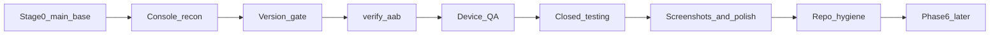

# Lost Number — Roadmap v1.1

| Поле               | Значення                                                                              |
| ------------------ | ------------------------------------------------------------------------------------- |
| Версія документа   | **1.2** (2026-08-13)                                                                  |
| Listing            | `com.Averixor.Lost_Number`                                                            |
| Ship version у git | **2.1.6 / versionCode 6**                                                             |
| Auth B2            | Shipped in source (Sign-In only); CT **NO-GO** до JSON + нового AAB                   |
| Cloud Save         | Deferred — після CT GO ([`FIREBASE_STAGE4_SEQUENCE.md`](FIREBASE_STAGE4_SEQUENCE.md)) |

## Стратегія

Godot 4.7 offline-головоломка → **Google Play Closed testing** → UX/візуальний polish → лише після стабільного мобільного релізу **Phase 6 Firebase** ([`docs/PHASES.md`](PHASES.md): Phase 5 → Phase 6).



## Етап 0 — Фіксація релізної бази `main`

PR #48 (`godot/fix-gothic-chrome-readability`) **уже merged** (2026-08-02): head `21a627b`, merge `1feda649`. Пункт «довести feature-гілку» **неактуальний**.

Задачі етапу 0:

1. Підтвердити CI для **цільового commit SHA** (не стверджувати «зелений» без run).
2. Тримати [`docs/AUDIT_PLAY_360.md`](AUDIT_PLAY_360.md) у `main` (PR #52) + Prettier/format gate.
3. Оновити таблицю аудитів і факт CI у [`docs/en/SOURCE_OF_TRUTH.md`](en/SOURCE_OF_TRUTH.md).
4. Збирати новий AAB **лише з конкретного SHA `main`**.

Формулювання для аудиту:

> Аудит початково виконано на `21a627b`; зміни PR #48 інтегровані в `main` через `1feda649`; перед релізом стан повторно звірено з актуальним HEAD.

Станом на `f2d69ddb`: workflow **CI** має `release-check` + `Godot tests (4.7.1)`; на цьому SHA обидва check-runs = success.

## Етап 1 — Play Console recon → version → AAB → device QA → Closed testing

### Жорсткий version gate

```text
Console max versionCode (новий listing com.Averixor.Lost_Number)
        ↓
max < 6  → upload 6 / 2.1.6
max ≥ 6  → bump max+1 (окремий PR) + rebuild
        ↓
Firebase JSON у AAB + Auth smoke PASS
        ↓
npm run release:check / godot:verify:aab
        ↓
Closed testing upload (новий SHA only)
```

Власник Console: [`docs/PLAY_CONSOLE_RECON.md`](PLAY_CONSOLE_RECON.md).  
Операції upload: [`docs/CLOSED_TESTING_RUNBOOK.md`](CLOSED_TESTING_RUNBOOK.md).

### Device QA

Повний сценарний чеклист — [`docs/ANDROID_QA.md`](ANDROID_QA.md) (окремий PR). DoD етапу 1 включає сценарії: clean install, Boot→Menu→Game, діагоналі/довгі ланцюги, save/kill/restore, backup recovery, Android Back, pause/audio, uk/ru/en, low-effects, immersive/notch, Wheel/Daily/Achievements, upgrade-over-install, legacy migration plugin.

### Скріншоти (зсув ближче до Closed testing)

- **До** запрошення зовнішніх тестерів: ≥2 справжні Godot/device скріншоти.
- **Після** першого feedback: повний комплект із 4.
- Promo drafts — лише тимчасовий внутрішній матеріал.

## Етап 2 — Polish після Closed testing

Prep (без CT): [`STAGE2_PREP.md`](STAGE2_PREP.md) — hybrid wheel, Import stub B, порядок PR.  
VISUAL_TARGET, Settings Import stub UX, розмір AAB, фінальні 4 скріншоти. Firebase — ні.

## Етап 3 — Repo hygiene (окремий PR)

`fix/repo-hygiene`: видалити tracked `.bak` / `.broken` / soft-gothic / зайві `.import`. Не змішувати з version bump.

## Етап 4 — Phase 6 Firebase

**Kickoff docs ready; runtime blocked.** Offline-first лишається; Firebase optional після OWNER go.

| Статус           | Документ / гілка                                                                                                                                           |
| ---------------- | ---------------------------------------------------------------------------------------------------------------------------------------------------------- |
| **OWNER path**   | [`FIREBASE_STAGE4_SEQUENCE.md`](FIREBASE_STAGE4_SEQUENCE.md) — Auth-ready AAB → CT smoke → Cloud Save approve → gates                                      |
| Docs / Auth B2   | [`AUTH_SIGNIN_QA.md`](AUTH_SIGNIN_QA.md), [`FIREBASE_STAGE4_GATES.md`](FIREBASE_STAGE4_GATES.md), [`FIREBASE_PRIVACY_DELTA.md`](FIREBASE_PRIVACY_DELTA.md) |
| Auth B2 runtime  | **Shipped** (Sign-In only); CT **NO-GO** до JSON + нового AAB                                                                                              |
| Cloud Save 4B/4C | **BLOCKED** до CT GO + OWNER flip gates                                                                                                                    |

**Наступний OWNER крок:** `google-services.json` → rebuild → Sign-In smoke → CT ([`CLOSED_TESTING_RUNBOOK.md`](CLOSED_TESTING_RUNBOOK.md)).

## Розділення PR (обов’язково)

| Гілка / PR                 | Зміст                                                                                                   |
| -------------------------- | ------------------------------------------------------------------------------------------------------- |
| `docs/roadmap-v1.1-sot-ci` | ROADMAP v1.1, SoT CI + audit index, audit narrative, Prettier AUDIT, recon/runbook **без** version bump |
| `docs/android-device-qa`   | Повний device checklist                                                                                 |
| `fix/repo-hygiene`         | Junk cleanup only                                                                                       |
| `godot/release-vc-bump`    | Якщо Console max VC ≥ 6 — bump code + rebuild                                                           |

## Що свідомо не стверджуємо без перевірки

- Історія upload / max versionCode у Play Console
- Збіг fingerprints upload key (локальні SHA є в recon — звірка власником)
- Identity verification status
- «CI зелений» без конкретного successful run для target SHA
- Device QA sign-off

## Не змінюємо найближчим часом

Offline-first, Godot-only ship, exclude store/tests з AAB, secrets поза git, Production до identity approval.
