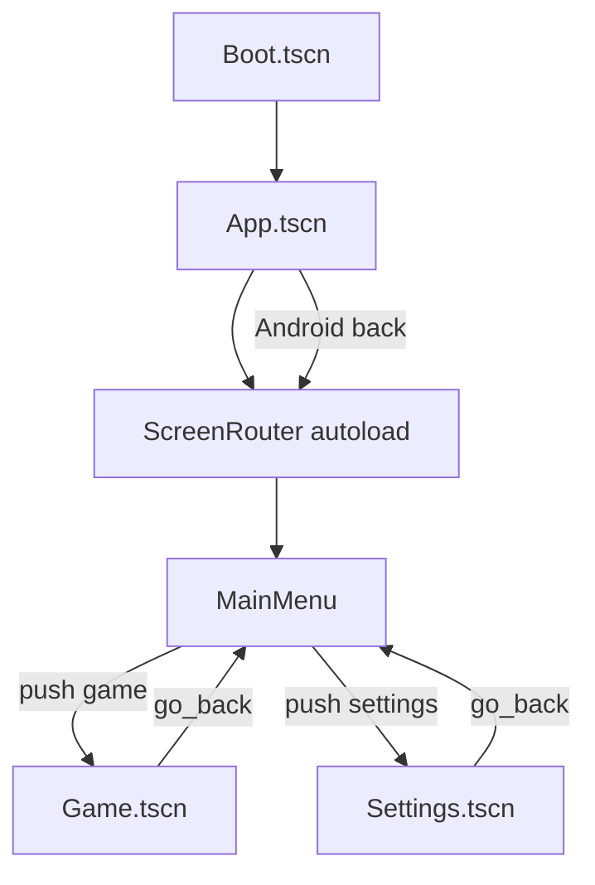

# Architecture & Repository Layout

High-level technical architecture for Lost Number **2.1.6**. Godot 4.5 is the production runtime; the web stack is the visual reference.

## System overview

```
┌─────────────────────────────────────────────────────────┐
│  Google Play  ←  lost-number.aab (Godot, recommended)   │
├─────────────────────────────────────────────────────────┤
│  godot/          Boot→App shell, ScreenRouter, gameplay │
│  js/ + _site/    Web reference (visual parity source)   │
│  android/        Capacitor shell (legacy WebView)       │
│  assets/         Shared neon UI, icons, backgrounds     │
│  store/          Play Console listing + graphics        │
└─────────────────────────────────────────────────────────┘
```

| Layer           | Stack                                        | Role                                        |
| --------------- | -------------------------------------------- | ------------------------------------------- |
| Gameplay (ship) | Godot 4.5 GDScript                           | Boot → App → screens; back-stack navigation |
| Web reference   | Vanilla JS + Capacitor 7                     | Visual/UI/i18n source; legacy Android       |
| Save            | `user://` JSON (Godot), `localStorage` (web) | Checksum + `.bak` rollback (Godot)          |
| Network         | None                                         | Offline-only; no PII                        |
| CI              | GitHub Actions                               | `release:check` on push/PR                  |

## Godot runtime architecture

### Autoloads (`project.godot`)

| Autoload              | Responsibility                                     |
| --------------------- | -------------------------------------------------- |
| `SaveManager`         | Persist/load game state, checksum envelope, backup |
| `SettingsManager`     | User preferences, `bg_effects_enabled`, locale     |
| `AudioManager`        | SFX pool, music, semantic event mapping            |
| `I18nManager`         | uk/ru/en JSON dictionaries                         |
| `ThemeManager`        | dawn/dusk/twilight, background rotation            |
| `LeaderboardService`  | Offline queue stub                                 |
| `ScreenRouter`        | Screen navigation, back-stack, transitions         |
| `LegacySaveMigration` | Capacitor → Godot save import                      |

### Scene graph

```
Boot.tscn (main_scene)
└── preload → App.tscn
    ├── BackgroundLayer.tscn    global art + particles
    ├── ScreenRoot              active screen (swapped by ScreenRouter)
    ├── OverlayRoot             modals, FeatureStubOverlay
    └── ScreenTransition.tscn   fade/slide cover-uncover
```

Registered screens (`ScreenRouter.SCREENS`): MainMenu, Game, Settings, Achievements, DailyQuests, Wheel, Stats, About, SkinPreview.

### Core gameplay modules

| Module          | Path                             | Role                                                                 |
| --------------- | -------------------------------- | -------------------------------------------------------------------- |
| Rules           | `scripts/core/Rules.gd`          | Chain validation (1:1 with `rules.js`)                               |
| Board logic     | `scripts/core/BoardLogic.gd`     | Merge, gravity, spawn                                                |
| Level manager   | `scripts/core/LevelManager.gd`   | 40 preset levels + procedural endless; targets, carry, spawn weights |
| Game state      | `scripts/core/GameState.gd`      | Session state                                                        |
| Board view      | `scripts/game/Board.gd`          | Grid rendering, input                                                |
| Tile            | `scripts/game/Tile.gd`           | Tile visuals, tweens, chain highlight                                |
| Chain line      | `scripts/game/ChainLineLayer.gd` | 3-pass neon glow for active chain                                    |
| Game controller | `scripts/game/Game.gd`           | Orchestrates board + HUD + overlays                                  |
| Bonuses         | `scripts/game/BonusManager.gd`   | Shuffle, destroy, explosion                                          |

### Meta / UI modules

| Module            | Path                                | Role                                           |
| ----------------- | ----------------------------------- | ---------------------------------------------- |
| GameHud           | `scripts/ui/GameHud.gd`             | XP, target, bonus row                          |
| ThemeTokens       | `scripts/ui/ThemeTokens.gd`         | Dark Neon Fantasy palette + dawn/dusk          |
| LnUi              | `scripts/ui/LnUi.gd`                | Shared UI helpers, backgrounds, entrance anims |
| NeonButton        | `scenes/components/NeonButton.tscn` | Primary/ghost menu buttons                     |
| WheelManager      | `scripts/meta/WheelManager.gd`      | Spin logic                                     |
| DailyQuestManager | `scripts/meta/DailyQuestManager.gd` | Quest progress                                 |
| Achievements      | `scripts/ui/Achievements.gd`        | Achievement grid                               |

### Visual system (Dark Neon Fantasy)

Recent redesign centralizes tokens in `ThemeTokens.gd` (design spec v2) and applies them through:

- `lost_number_theme.tres` — global GUI theme
- `LnUi.gd` — screen backgrounds, panels, button styling, logo glow
- `NeonButton.tscn` — neon-bordered controls
- `BackgroundLayer.gd` — art textures, dim overlay, optional particles
- `ChainLineLayer.gd` — chain path neon rendering
- Per-screen scripts (MainMenu, Settings, Stats, etc.) calling `LnUi` helpers

`ThemeManager.gd` maps dawn/dusk/twilight to token sets and manages 6 background PNGs per bucket under `godot/assets/ui/backgrounds/`.

## Repository layout

```
LostNumber/                      ← canonical project root
├── godot/                       # Ship target for Play
│   ├── project.godot            # version 2.1.6, main_scene → Boot.tscn
│   ├── scenes/                  # Boot, App, screens, components
│   ├── scripts/                 # core, game, ui, managers, meta, tests
│   ├── assets/ui/               # In-game graphics (icons, backgrounds)
│   ├── assets/i18n/             # uk.json, ru.json, en.json (285 keys)
│   ├── themes/                  # lost_number_theme.tres
│   ├── android/plugins/         # LostNumberMigration AAR + .gdap
│   └── docs/                    # Godot-specific technical docs
├── android/                     # Capacitor (legacy WebView shell)
├── js/, css/, index.html        # Web game source
├── assets/, public/audio/       # Shared media (ported into godot/assets/)
├── store/                       # Play Console listing assets (not in AAB)
├── build/godot/android/         # Prebuilt APK/AAB (gitignored)
├── docs/                        # Project docs (uk + docs/en/)
├── scripts/                     # Build, verify, export npm scripts
├── privacy.html                 # Privacy policy
├── HANDOFF-IDEAL.md             # Production handoff summary
└── PROJECT_STRUCTURE.md         # Detailed folder map
```

## Key technical decisions (from engineering chats)

| Topic                 | Decision                                                      | Rationale                                                     |
| --------------------- | ------------------------------------------------------------- | ------------------------------------------------------------- |
| Single App shell      | `App.tscn` + `ScreenRouter` instead of `change_scene_to_file` | Persistent background, overlay layer, back-stack              |
| Save integrity        | SHA-256 envelope + `.bak`                                     | Corruption recovery without cloud                             |
| No encryption at rest | Checksum only                                                 | No secrets in save; offline game                              |
| ABI filter            | arm64-v8a + x86_64 only                                       | Drop legacy 32-bit (~8k devices)                              |
| Image picker          | `ImagePickerHelper.gd`                                        | Custom background without MobileImagePicker dependency        |
| Legacy migration      | Android plugin + file import                                  | Upgrade path from Capacitor WebView saves                     |
| Visual source         | Web CSS/JS                                                    | `VISUAL_PORT_MAP.md` tracks port status per screen            |
| Low performance       | `bg_effects_enabled`                                          | Mirrors web `low-performance.css`; disables particles + slide |
| Floating numbers      | Removed (Phase 5.6)                                           | FPS regression on weak devices                                |
| Firebase / cloud      | Phase 6 — not started                                         | Blocked until Phase 5 performance closed                      |

## Approved plans

### Sprint: Godot visual parity (`godot-visual-parity` branch)

Delivered: ThemeTokens, global theme, `assets/ui/`, BackgroundLayer, NeonButton, MainMenu (dock + quick-row + icons), Stats/About, FeatureStubOverlay, legacy save plugin AAR, `bg_effects_enabled` in Settings.

Tracker: `godot/docs/VISUAL_PORT_MAP.md`.

### Phase 5 — performance (web; principles apply to Godot)

- FPS monitoring in dev tools
- Grid sync after shuffle/gravity
- Lite/low-performance visual mode

**Gate:** No noticeable UI regressions; grid stays in sync after long sessions. See `docs/PHASES.md`.

### Phase 6 — Firebase (future)

- Google Auth
- Firestore `users/{uid}/save/current`
- Conflict resolution: greater `updatedAt` wins
- Fallback: local save when offline

**Not started** — do not implement until Phase 5 is closed.

## CI / automation

| Workflow                      | Purpose                                                        |
| ----------------------------- | -------------------------------------------------------------- |
| `.github/workflows/ci.yml`    | `npm run release:check` on push/PR (no `godot:test:all` in CI) |
| `.github/workflows/pages.yml` | Deploy `_site/` to GitHub Pages                                |

Local full gate: `npm run release:ideal` (includes Godot tests).

## Android plugin architecture

`LostNumberMigration` plugin (`godot/android/plugins/`):

- `.gdap` at `android/plugins/` top level (Godot 4.5 requirement)
- Scans files dir, shared_prefs, WebView LevelDB for `lostNumberSave`
- Caches export to `files/lostnumber_legacy_export.json`
- Enabled in `export_presets.cfg`: `plugins/LostNumberMigration=true`

## Navigation sequence (reference)



## Dual-stack risk

Godot is the **sole** Play upload path. The Capacitor/Web stack exists for visual parity reference and legacy save migration testing. Do not treat the WebView AAB as primary.

## Further reading

- [SOURCE_OF_TRUTH.md](./SOURCE_OF_TRUTH.md) — canonical decisions and version snapshot
- [DECISIONS.md](./DECISIONS.md) — save, i18n, screens, compliance
- [MIGRATION_GODOT.md](./MIGRATION_GODOT.md) — JS → Godot parity checklist
- [RELEASE.md](./RELEASE.md) — build and Play Console checklists
- [godot/README.md](../../godot/README.md) — Godot quick start
