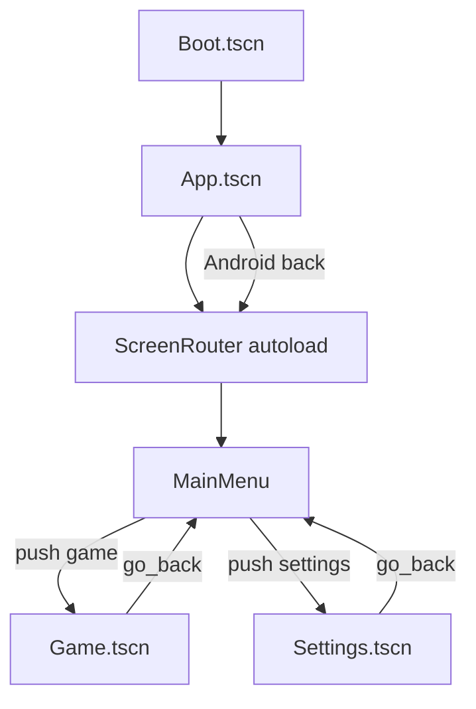

## Architecture & Repository Layout

High-level technical architecture for Lost Number **2.1.7**. Godot 4.7 is the sole production runtime.

### System overview

```text
┌─────────────────────────────────────────────────────────┐
│  Google Play  ←  lost-number.aab (Godot)                │
├─────────────────────────────────────────────────────────┤
│  godot/          Boot→App shell, ScreenRouter, gameplay │
│  android/        firebase/ + local keystore (gitignored)│
│  store/          Play Console listing + graphics        │
│  privacy.html    Play Store privacy policy (static)     │
└─────────────────────────────────────────────────────────┘
```

| Layer           | Stack                  | Role                                                                |
| --------------- | ---------------------- | ------------------------------------------------------------------- |
| Gameplay (ship) | Godot 4.7 GDScript     | Boot → App → screens; back-stack navigation                         |
| Save            | `user://` JSON (Godot) | Checksum + `.bak` rollback                                          |
| Network         | Optional               | Offline play by default; optional Google Sign-In (Firebase Auth B2) |
| CI              | GitHub Actions         | `release:check` **and** `godot:test:all` (Godot 4.7.1) on push/PR   |

### Godot runtime architecture

#### Autoloads (`project.godot`)

| Autoload              | Responsibility                                        |
| --------------------- | ----------------------------------------------------- |
| `SaveManager`         | Persist/load game state, checksum envelope, backup    |
| `SettingsManager`     | User preferences, `bg_effects_enabled`, locale        |
| `AudioManager`        | SFX pool, music, semantic event mapping               |
| `I18nManager`         | uk/ru/en JSON dictionaries                            |
| `ThemeManager`        | Release dusk-only brightness; VisualSkin; backgrounds |
| `LeaderboardService`  | Offline queue stub                                    |
| `AuthManager`         | Optional Google Sign-In (Firebase Auth)               |
| `ScreenRouter`        | Screen navigation, back-stack, transitions            |
| `LegacySaveMigration` | Capacitor → Godot save import                         |

#### Scene graph

```text
Boot.tscn (main_scene)
└── preload → App.tscn
    ├── BackgroundLayer.tscn    global art + particles
    ├── ScreenRoot              active screen (swapped by ScreenRouter)
    ├── OverlayRoot             modals, FeatureStubOverlay
    └── ScreenTransition.tscn   fade/slide cover-uncover
```

Registered screens (`ScreenRouter.SCREENS`): MainMenu, Game, Settings, Achievements, DailyQuests, Wheel, Stats, About, SkinPreview, BackgroundPreview.

#### Core gameplay modules

| Module          | Path                             | Role                                                                            |
| --------------- | -------------------------------- | ------------------------------------------------------------------------------- |
| Rules           | `scripts/core/Rules.gd`          | Chain validation (historical parity: `docs/archive/js-reference/rules.js`)      |
| Board logic     | `scripts/core/BoardLogic.gd`     | Merge, gravity, spawn                                                           |
| Level manager   | `scripts/core/LevelManager.gd`   | 40 algorithmically generated initial configs + procedural branch from index 40+ |
| Game state      | `scripts/core/GameState.gd`      | Session state                                                                   |
| Board view      | `scripts/game/Board.gd`          | Grid rendering, input                                                           |
| Tile            | `scripts/game/Tile.gd`           | Tile visuals, tweens, chain highlight                                           |
| Chain line      | `scripts/game/ChainLineLayer.gd` | 3-pass neon glow for active chain                                               |
| Game controller | `scripts/game/Game.gd`           | Orchestrates board + HUD + overlays                                             |
| Bonuses         | `scripts/game/BonusManager.gd`   | Shuffle, destroy, explosion                                                     |

#### Meta / UI modules

| Module            | Path                                | Role                                                            |
| ----------------- | ----------------------------------- | --------------------------------------------------------------- |
| GameHud           | `scripts/ui/GameHud.gd`             | XP, target, bonus row                                           |
| ThemeTokens       | `scripts/ui/ThemeTokens.gd`         | Dark fantasy palette tokens (legacy dawn tokens remain in code) |
| VisualSkin        | `scripts/ui/VisualSkin.gd`          | Skin kits: `gothic_crystal` \| `procedural_neon`                |
| LnUi              | `scripts/ui/LnUi.gd`                | Shared UI helpers, backgrounds, entrance anims                  |
| NeonButton        | `scenes/components/NeonButton.tscn` | Primary/ghost menu buttons                                      |
| WheelManager      | `scripts/meta/WheelManager.gd`      | Spin logic                                                      |
| DailyQuestManager | `scripts/meta/DailyQuestManager.gd` | Quest progress                                                  |
| Achievements      | `scripts/ui/Achievements.gd`        | Achievement grid                                                |

#### Visual system (gothic fantasy + VisualSkin)

North star: `docs/en/VISUAL_TARGET.md` (environment-integrated stone/metal chrome). Tokens live in `ThemeTokens.gd`; skins in `VisualSkin.gd` / `ThemeManager.visual_skin_id`.

- `lost_number_theme.tres` — global GUI theme (gold/stone, not neon-purple outlines)
- `LnUi.gd` — screen backgrounds, panels, button styling, logo glow
- `Gothic*` / `GothicScreenMixin.gd` — carved chrome when `gothic_crystal` is active; skipped for `procedural_neon`
- `BackgroundLayer.gd` — art textures, dim overlay, optional particles (real path under App shell)
- `ChainLineLayer.gd` — chain path rendering
- Per-screen scripts calling `LnUi` / gothic helpers

`ThemeManager.gd` **release policy:** `RELEASE_THEME_ID` / `UI_CYCLE_THEMES` = `["dusk"]` only; `is_dark()` always true; ThemeButton hidden. Legacy dawn/twilight ids normalize to dusk (assets may remain on disk). Background carousel uses the dark bucket (6 PNGs under `godot/assets/ui/backgrounds/`). **VisualSkin:** `gothic_crystal` (default) and `procedural_neon` (Skin Preview fallback kit), both persist across restart.

### Repository layout

```text
LostNumber/                      ← canonical project root
├── godot/                       # Ship target for Play
│   ├── project.godot            # version 2.1.7, main_scene → Boot.tscn
│   ├── scenes/                  # Boot, App, screens, components
│   ├── scripts/                 # core, game, ui, managers, meta, tests
│   ├── assets/ui/               # In-game graphics (icons, backgrounds)
│   ├── assets/i18n/             # uk.json, ru.json, en.json (330 keys)
│   ├── themes/                  # lost_number_theme.tres
│   └── android/plugins/         # LostNumberMigration + LostNumberFirebase AAR/.gdap
├── android/firebase/            # google-services.json (dev/prod)
├── android/keystore/            # Release signing (gitignored; local)
├── store/                       # Play Console listing assets (not in AAB)
├── build/android/               # Prebuilt APK/AAB (gitignored)
├── docs/                        # Project docs (uk + docs/en/ + archive/)
├── scripts/                     # Build, verify, export npm scripts
├── privacy.html                 # Privacy policy
└── README.md                    # Quick start → docs/
```

### Key technical decisions (from engineering chats)

| Topic                 | Decision                                                      | Rationale                                                                    |
| --------------------- | ------------------------------------------------------------- | ---------------------------------------------------------------------------- |
| Single App shell      | `App.tscn` + `ScreenRouter` instead of `change_scene_to_file` | Persistent background, overlay layer, back-stack                             |
| Save integrity        | SHA-256 envelope + `.bak`                                     | Corruption recovery without cloud                                            |
| No encryption at rest | Checksum only                                                 | No secrets in save; offline game                                             |
| ABI filter            | arm64-v8a + x86_64 only                                       | Drop legacy 32-bit (~8k devices)                                             |
| Image picker          | `ImagePickerHelper.gd`                                        | Custom background without MobileImagePicker dependency                       |
| Legacy migration      | Android plugin + file import                                  | Upgrade path from old Web/Capacitor saves                                    |
| Visual source         | PO mockups + [VISUAL_TARGET.md](./VISUAL_TARGET.md)           | Gothic fantasy integration; archive map in `docs/archive/VISUAL_PORT_MAP.md` |
| Low performance       | `bg_effects_enabled`                                          | Mirrors web `low-performance.css`; disables particles + slide                |
| Floating numbers      | Removed (Phase 5.6)                                           | FPS regression on weak devices                                               |
| Firebase / cloud      | Auth-only (B2) shipped; Cloud Save still deferred             | `AuthManager` + `LostNumberFirebase`; ADR `docs/en/FIREBASE_ADR.md`          |

### Approved plans

#### Sprint: Godot visual parity (`godot-visual-parity` branch)

Delivered: ThemeTokens, global theme, `assets/ui/`, BackgroundLayer, NeonButton, MainMenu (dock + quick-row + icons), Stats/About, FeatureStubOverlay, legacy save plugin AAR, `bg_effects_enabled` in Settings.

Tracker: [docs/archive/VISUAL_PORT_MAP.md](../archive/VISUAL_PORT_MAP.md) (historical).

#### Phase 5 — performance (web; principles apply to Godot)

- FPS monitoring in dev tools
- Grid sync after shuffle/gravity
- Lite/low-performance visual mode

**Gate:** No noticeable UI regressions; grid stays in sync after long sessions. See `docs/PHASES.md`.

#### Phase 6 — Firebase (Stage 4)

- **Auth-only (B2)** shipped in code (`AuthManager` + `LostNumberFirebase` plugin)
- Cloud Save / Firestore still deferred — OWNER gates in [`FIREBASE_STAGE4_GATES.md`](../FIREBASE_STAGE4_GATES.md)
- Planned later: Firestore `users/{uid}/save/current`; SaveManager-first upload
- Offline play without account remains the default

See [`FIREBASE_ADR.md`](./FIREBASE_ADR.md) and [`SOURCE_OF_TRUTH.md`](./SOURCE_OF_TRUTH.md).

### CI / automation

| Workflow                   | Purpose                                                                           |
| -------------------------- | --------------------------------------------------------------------------------- |
| `.github/workflows/ci.yml` | `npm run release:check` **and** `npm run godot:test:all` (Godot **4.7.1** pinned) |

Local full gate: `npm run release:ideal` (format + lint + repo checks + Godot rules/save; skips if no `godot4`). Pre-upload: `npm run godot:verify:aab`.

### Android plugin architecture

Two plugins under `godot/android/plugins/` (enabled in `export_presets.cfg`):

**`LostNumberMigration`**

- `.gdap` at `android/plugins/` top level (Godot 4.5+ requirement)
- Scans files dir, shared_prefs, WebView LevelDB for `lostNumberSave`
- Caches export to `files/lostnumber_legacy_export.json`

**`LostNumberFirebase`**

- Kotlin bridge for optional Google Sign-In / Firebase Auth
- Requires OWNER-supplied `android/firebase/{dev,prod}/google-services.json`

### Navigation sequence (reference)


```mermaid
flowchart TD
    Boot[Boot.tscn] --> App[App.tscn]
    App --> Router[ScreenRouter autoload]
    Router --> MM[MainMenu]
    MM -->|push game| Game[Game.tscn]
    Game -->|go_back| MM
    MM -->|push settings| Settings[Settings.tscn]
    Settings -->|go_back| MM
    App -->|Android back| Router
```

### Ship target

Godot 4.7 AAB is the **sole** Play upload path. Web/JS/Capacitor stack removed from repo (July 2026). Legacy save import remains for users upgrading from old builds.

### Further reading

- [SOURCE_OF_TRUTH.md](./SOURCE_OF_TRUTH.md) — canonical decisions and version snapshot
- [DECISIONS.md](./DECISIONS.md) — save, i18n, screens, compliance
- [MIGRATION_GODOT.md](./MIGRATION_GODOT.md) — JS → Godot parity checklist
- [RELEASE.md](./RELEASE.md) — build and Play Console checklists
- [godot/README.md](../../godot/README.md) — Godot quick start
